## Step-by-Step Tutorial on How to Deploy and Use LoopToken

This contract has been deployed on the Ropsten Test Network under address: *0x75a9fD20a1C7Ae9cA5910D6Dc9e2fB5D84Ba48de.*

Link on Etherscan [HERE!](https://ropsten.etherscan.io/address/0x75a9fd20a1c7ae9ca5910d6dc9e2fb5d84ba48de)

1) Deploy the contract using 0 as the value initially.

2) Mint yourself some tokens using the 'Mint' function.

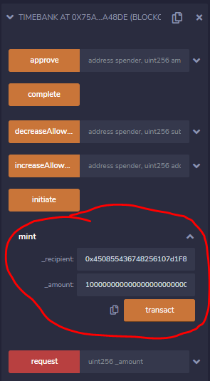

[Link to tx on Etherscan](https://ropsten.etherscan.io/tx/0x8d6ae4cde692e1c3da8606aecffcfcb5fcc237dcb6e4fe43a6599fb33ddb120d)

3) Using the 'Request' function from an account that has LOOPTokens in it, put in an hour (LoopToken amount) you want to request from somebody to do some tax preperation work for you.  In our case its 25000 LoopTokens! (Remember to put 18 zeros after the number!)

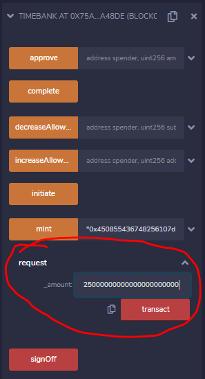

Click confirm on MetaMask. 

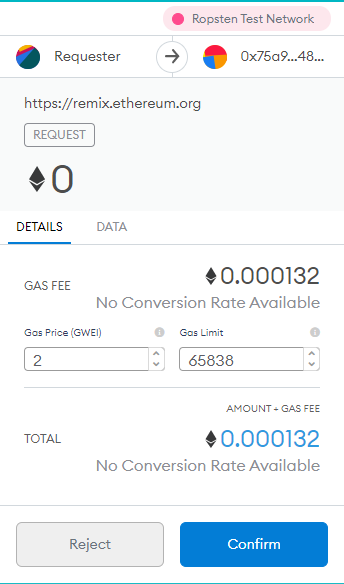

[Link to tx on Etherscan](https://ropsten.etherscan.io/tx/0xa5d8a281994cb25ee16c2ce9ec9ae980da4ce53b2b9cb619464859ab3a9ec2d6)

4) Under a different account, in our case 'Provider', use the 'Initiate' function to accept work from the person requesting it. 

In our example, the 'Provider' saw on the front-end website for Loop that somebody requested 25,000 hours (Wow!) of work to help with taxes.  The 'Provider' is a CPA and wants to help out and earn some LoopToken himself so he accepts the request. 

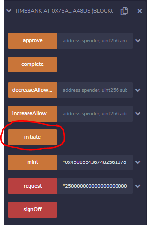

Click confirm on MetaMask. 

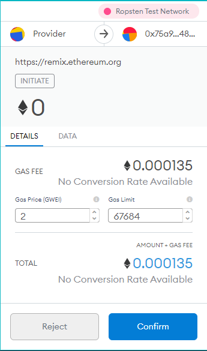

[Link to tx on Etherscan](https://ropsten.etherscan.io/tx/0x2e63ad8782b722fe86fd6c486e0dfe4fce6c4585cc6d76e6acb022db713a9b24)

5)  After you have completed you 25,000 hours of tax work for the requester, you now will use the 'Complete' function to sign off on your end of the transaction.  This would generate a message on the front end and let the Requester know that you are done with your work.

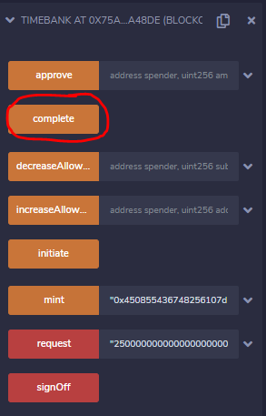

Click confirm on MetaMask. 

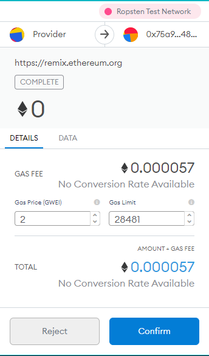

[Link to tx on Etherscan](https://ropsten.etherscan.io/tx/0xd372f3acea42bee20b43599a22cf3fbaa43e6c388afbc36a80dc56a488fae1bf)

6)  Switch back to your Requester account.  Now you are ready to sign off the transaction, confirming on your end that the work you requested was completed to your satisfaction and will transfer the LoopTokens from your account to the Provider account.

Before we can sign off, we need to use the built in ERC20 'Approve' function to approve moving tokens.  Put the requester account # in spender and the amount of hours requested in the amount: 

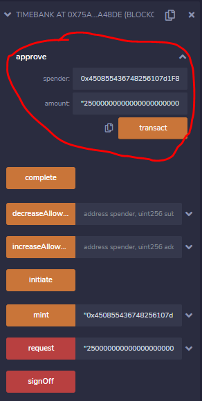

Click confirm on MetaMask.

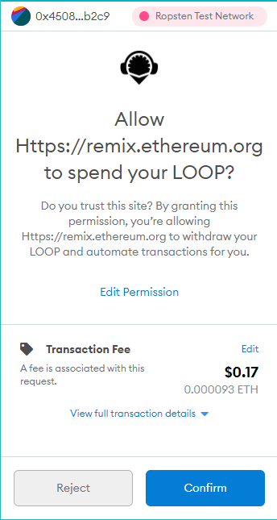

[Link to tx on Etherscan](https://ropsten.etherscan.io/tx/0x8912991ca777eef9d5147b1fa710bf384eae5bda3c1e324330ad71846dae650c)

7) Now we can use the signOff function to move tokens.  Click 'signOff' and you will send LoopTokens from your account to the Provider account, thus ending the overall transaction.

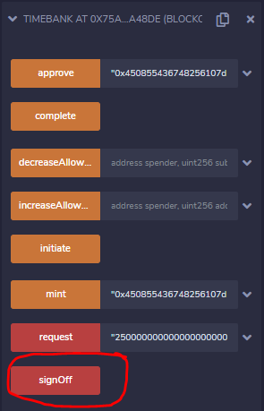

Click confirm on MetaMask. 

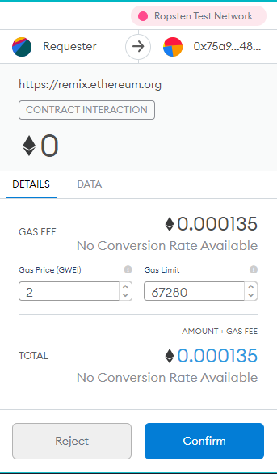

[Link to tx on Etherscan](https://ropsten.etherscan.io/tx/0x9ec3b59158086647c12ef18f09442c392d73bc4f8a982ad39d510d4386cf192f)

**Congratulations!  You have now sent LoopTokens from one account to another.  If you check the balance of your accounts the Tokens should have moved from the Requester account to the Provider account**

